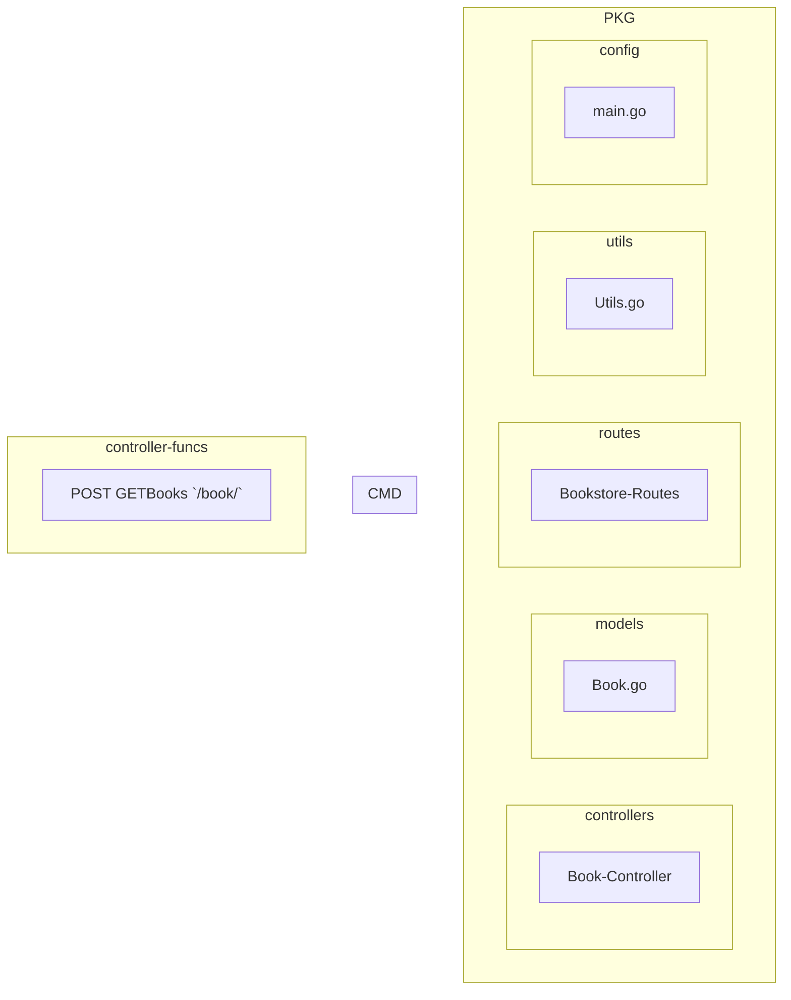

# Ref
- [GO And MYSQL - 2021 Project 🚀 💣 🔥 - Connect Go with Mysql / Build a Book Management System](https://youtu.be/1E_YycpCsXw)

# Use
- MySQL
- GORM
- Json marshall, unmarshall
- Project structure
- Groilla Mux

