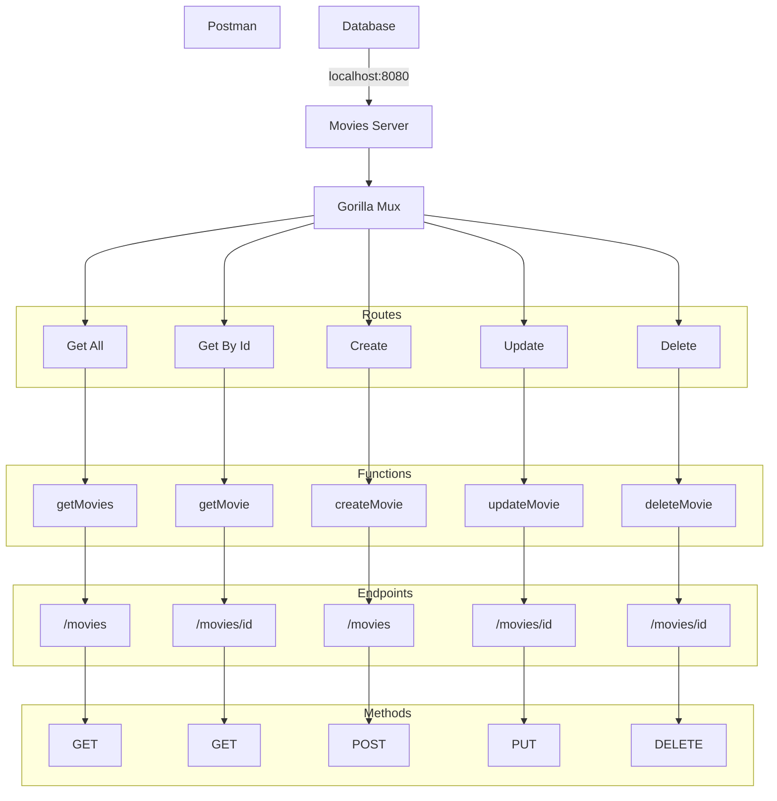

```mermaid
flowchart TB
    PM[Postman]
    DB[Database]
    MS[Movies Server]
    GM[Gorilla Mux]

    subgraph Routes
    ga[Get All]
    gbi[Get By Id]
    cr[Create]
    up[Update]
    del[Delete]
    end

    subgraph Functions
    gms[getMovies]
    gm[getMovie]
    crm[createMovie]
    upm[updateMovie]
    delm[deleteMovie]
    end

    subgraph Endpoints
    /gm["/movies"]
    /gmid["/movies/id"]
    /crm["/movies"]
    /upm["/movies/id"]
    /delm["/movies/id"]
    end

    subgraph Methods
    g[GET]
    gid[GET]
    po[POST]
    pu[PUT]
    dele[DELETE]
    end

    DB -->|localhost:8080| MS --> GM

    GM ---> ga ---> gms
    GM ---> gbi ---> gm
    GM ---> cr ---> crm
    GM ---> up ---> upm
    GM ---> del ---> delm

    gms -->  /gm
    gm  -->  /gmid
    crm -->  /crm
    upm -->  /upm
    delm --> /delm

    /gm   -->  g    
    /gmid -->  gid
    /crm  -->  po
    /upm  -->  pu
    /delm -->  dele
```