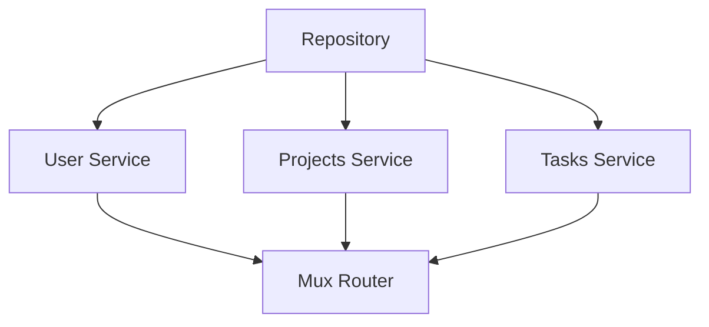
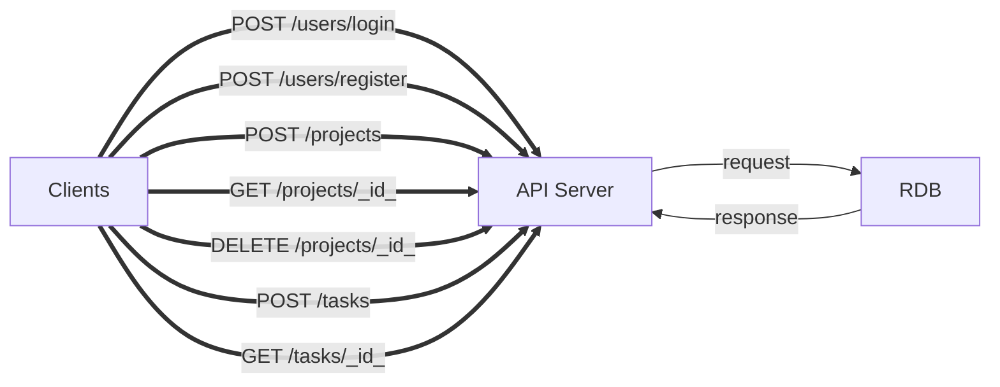

# Diagrams

_Ref : [Link](https://youtu.be/2JNUmzuBNV0?si=aL4TDhaBeT6011Uc)_

```mermaid
flowchart TB

    R[Repository]
    US[User Service]
    PS[Projects Service]
    TS[Tasks Service]
    MR[Mux Router]

    R --> US --> MR
    R --> PS --> MR
    R --> TS --> MR
```

```mermaid
flowchart LR
    cs[Clients]
    api[API Server]
    db[RDB]


    cs ===>|POST /users/login| api
    cs ===>|POST /users/register| api
    cs ===>|POST /projects| api
    cs ===>|GET /projects/_id_| api
    cs ===>|DELETE /projects/_id_| api
    cs ===>|POST /tasks| api
    cs ===>|GET /tasks/_id_| api

    api --->|request| db
    db --->|response| api
```